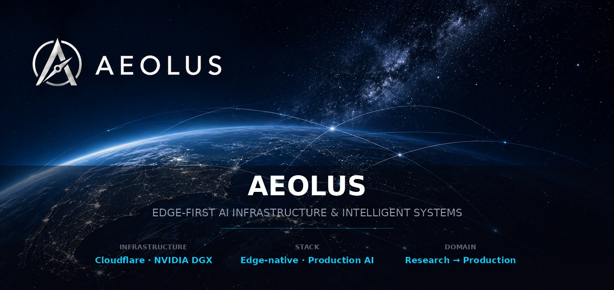

<div align="center">
  <picture>
    <source media="(prefers-color-scheme: dark)" srcset="aeolus-org-header.jpg">
    <source media="(prefers-color-scheme: light)" srcset="aeolus-org-header.jpg">
    
  </picture>
</div>

---

We design, build, and operate **production-grade AI infrastructure** — from inference at the edge to multi-agent media platforms — running predominantly on Cloudflare Workers, with GPU acceleration on NVIDIA DGX.

### What We Build

Edge-native platforms that ingest, reason, and act on real-world data — at scale, without the overhead of traditional cloud. We skip the hype and ship systems that move money, media, and mission-critical decisions across industries where "good enough" isn't.

Our work lives at the intersection of:
- **Inference-first architecture** — LLMs aren't bolted on, they're the control plane
- **Edge-native distribution** — Cloudflare Workers, D1, R2, Queues — the stack is the strategy
- **Research-to-production** — From SageAttention on Blackwell to production media pipelines in the same week

### Our Stack

```
☁️ Edge    → Cloudflare Workers · D1 · R2 · KV · Queues · Vectorize · AI Gateway
🤖 AI      → Workers AI · Voyage AI · Ollama · ComfyUI on NVIDIA DGX
🗄️ Data    → DuckDB · pgvector · Drizzle ORM · AetherDB
⚙️ Orchestr → Temporal · Hono · FastAPI
🌐 Frontend → Next.js 16 · React 19 · TailwindCSS v4
🔬 Research → SageAttention (FP8) · FLUX · V-JEPA 2 · RF-DETR
```

### Open Source

| Repo | What |
|------|------|
| [ubertool](https://github.com/AeolusConsulting/ubertool) | 🦀 Agent-friendly Rust CLI — dev utilities, crypto, JWT, OTP, IBAN |
| [agentskillz](https://github.com/mieitza/agentskillz) | Shared agent memory — one MCP server, one skill, every agent speaks the same memory |
| [comfyui-aeon-spark](https://github.com/mieitza/comfyui-aeon-spark) | ComfyUI for NVIDIA DGX — CUDA 13 + SageAttention |
| [whisperx-blackwell](https://github.com/mieitza/whisperx-blackwell) | GPU-accelerated WhisperX on NVIDIA Blackwell |

### From the Lab

LeWorldModel · V-JEPA 2 · RuView · llm-council · AetherDB

---

<div align="center">
  <small>
    <a href="https://aeolusconsulting.ro">Website</a> ·
    <a href="https://aeolusconsulting.ro/insights">Blog</a> ·
    <a href="mailto:contact@aeolusconsulting.ro">Contact</a>
  </small>
  <br/>
  <small>Bucharest, Romania · Edge-first since 2024</small>
</div>
